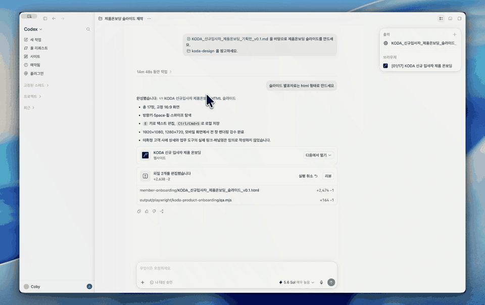
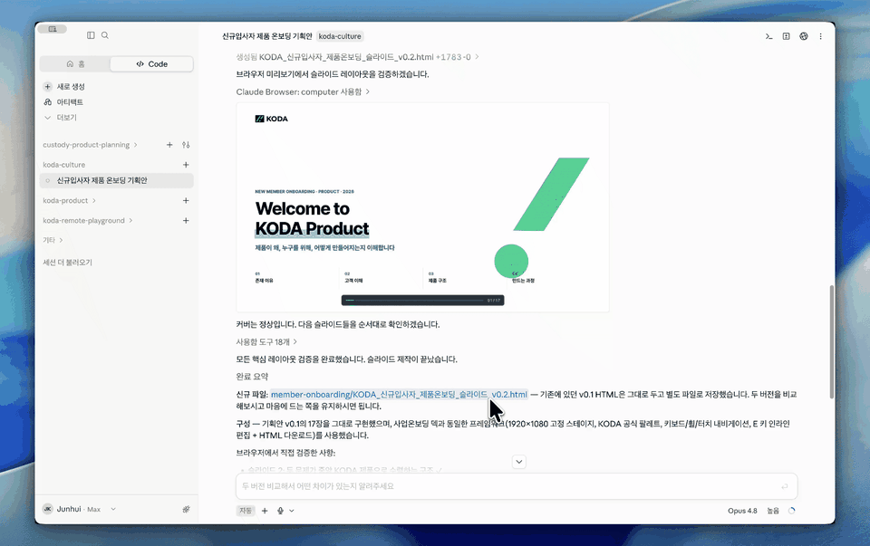

# KODA Presentation Design System

KODA 구성원이 AI와 함께 발표자료를 만들 때 일관된 KODA 브랜딩을 적용할 수 있도록 정리한 발표자료용 디자인 시스템입니다.

이 저장소의 [`DESIGN.md`](./DESIGN.md)에는 슬라이드 비율, 색상, 글꼴, 여백, 레이아웃과 시각 표현 규칙이 담겨 있습니다. [`slide_assets`](./slide_assets) 폴더에는 발표자료에 사용할 KODA 로고와 심볼이 있습니다.

## 가장 쉬운 시작 방법

Git이나 개발 도구를 몰라도 괜찮습니다. 로컬 파일을 다룰 수 있는 ChatGPT·Codex·Claude 등의 AI에게 아래 문장을 그대로 보내세요.

> `https://github.com/korea-digital-asset-corp-website/presentation-design.git`을 제 작업 폴더에 내려받아 주세요. Git으로 복제하고, 완료되면 저장된 위치를 알려주세요.

AI가 알려준 `presentation-design` 폴더의 위치를 기억해 두면 됩니다. 이미 GitHub에서 ZIP 파일을 내려받았다면 압축을 푼 폴더를 사용할 수도 있지만, ZIP 방식은 아래의 자동 업데이트 기능을 이용할 수 없습니다.

## 발표자료 만들기

AI와 작업 중인 프로젝트에서 다음 중 편한 방법을 사용하세요.

- AI에게 `presentation-design` 폴더의 위치를 알려주기
- 대화나 프로젝트에 `presentation-design` 폴더를 직접 첨부하기

그다음 아래 예시처럼 요청하면 됩니다.

> 첨부한 기획안을 바탕으로 발표자료를 만들어 주세요. KODA 발표 디자인 시스템은 `/내가/저장한/위치/presentation-design`에 있습니다. `DESIGN.md`와 `slide_assets`를 참고해 KODA 브랜딩을 일관되게 적용해 주세요.

원하는 결과물에 따라 마지막 문장을 덧붙이세요.

- PowerPoint가 필요할 때: `최종 결과를 PPTX 파일로 만들어 주세요.`
- HTML 발표자료가 필요할 때: `발표자료를 16:9 HTML로 만들고 PDF로도 변환해 주세요.`

## HTML로 만들기를 권장하는 이유

AI는 웹 화면 구현에 강하기 때문에 발표자료도 HTML로 먼저 만들면 레이아웃을 빠르고 정확하게 다듬기 쉽습니다. 완성된 HTML은 PDF로 변환해 공유하거나 발표할 수 있습니다.

ChatGPT·Codex·Claude처럼 앱 안에서 브라우저를 지원하는 도구에서는 HTML 발표자료를 사이드바 브라우저로 열어 바로 확인할 수 있습니다. 화면에서 수정할 곳에 직접 주석을 달고 AI에게 다시 요청하면, 슬라이드와 대화를 오가며 직관적으로 다듬을 수 있습니다.

### ChatGPT·Codex에서 작업하는 모습



### Claude에서 작업하는 모습



## 최신 버전으로 업데이트하기

Git 명령을 직접 입력할 필요가 없습니다. `presentation-design` 폴더를 AI에서 열거나 그 위치를 알려준 뒤 아래 문장만 보내세요.

> KODA 발표자료 디자인 시스템을 최신 버전으로 업데이트해 주세요.

프로젝트에 포함된 `update-koda-presentation-design` Skill이 현재 작업물을 먼저 확인한 다음 공식 저장소의 최신 `main` 버전을 `git pull`로 받아옵니다.

- 변경된 파일이 없으면 기존 작업 이력을 바꾸지 않는 안전한 방식으로 업데이트합니다.
- 이미 최신 버전이면 그대로 알려줍니다.
- 수정 중인 파일이 있으면 덮어쓰지 않고 멈춘 뒤, 보관 방법을 먼저 묻습니다.

ZIP으로 받은 폴더는 Git 저장소가 아니므로 이 기능을 사용할 수 없습니다. 자동 업데이트를 계속 이용하려면 위의 “가장 쉬운 시작 방법” 문장을 AI에게 보내 Git 방식으로 다시 받아 주세요.

## 폴더 안내

```text
presentation-design/
├── DESIGN.md        # KODA 발표자료 디자인 규칙
├── slide_assets/    # KODA 로고와 심볼
├── docs/media/      # AI 앱 활용 예시 영상
└── .agents/skills/  # AI가 사용하는 안전한 업데이트 Skill
```

## AI에게 함께 전달하면 좋은 정보

더 좋은 결과를 얻으려면 기획안과 함께 다음 내용을 알려주세요.

- 발표 목적과 청중
- 발표 시간 또는 원하는 슬라이드 수
- 반드시 포함할 문장, 수치, 표, 이미지와 출처
- 최종 파일 형식(HTML, PDF, PPTX 등)
- 초안 검토가 필요한 시점

내용이 완벽하게 정리되어 있지 않아도 괜찮습니다. AI에게 먼저 목차와 슬라이드별 핵심 메시지를 제안해 달라고 한 뒤, 내용을 확정하고 디자인 작업을 진행하면 됩니다.
